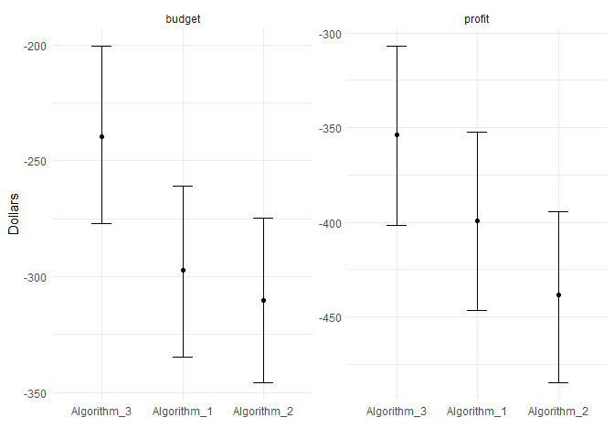
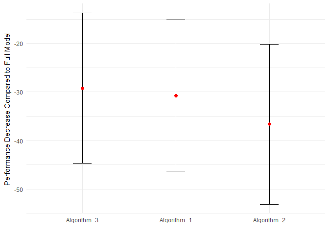

Readme
================

`algoeval` does evaluation of algorithmic output that is independent of the underlying algorithms. The algorithmic output can come from any kind of model; these are then combined in a Bayesian hierarchical model where a restrictive prior is put on the predictor coefficients. The algorithms are then evaluated based on how well they perform compared to the full model and a null model that only predicts an intercept.

How to use this package
-----------------------

This package can be downloaded and installed in R using the `devtools` package with the following command:

    devtools::install_github('saudiwin/algoeval')

All Stan code is compiled on install and then will be run within the package without recompiling.

A brief demonstration of the package follows.

First I simulate some algorithm data using default settings (3 algos).

``` r
sample_algos <- algo_sim(N=2000)
```

This produces a list that can be then be put into the `compare_algos` function. `budget` and `revenue` are left at their default values.

``` r
metrics <- algo_compare(algos=sample_algos$algos,outcome=sample_algos$outcome)
```

    ## [1] "Running models in Stan"

    ## Warning: There were 42 divergent transitions after warmup. Increasing adapt_delta above 0.95 may help. See
    ## http://mc-stan.org/misc/warnings.html#divergent-transitions-after-warmup

    ## Warning: Examine the pairs() plot to diagnose sampling problems

    ## [1] "Calculating budget performance for full model."
    ## [1] "Calculating budget performance for each individual algorithm against null model."
    ## [1] "Processing LOO for full model"
    ## Computed from 750 by 2000 log-likelihood matrix
    ## 
    ##          Estimate   SE
    ## elpd_loo  -1330.2 10.6
    ## p_loo         3.4  0.1
    ## looic      2660.4 21.1
    ## 
    ## All Pareto k estimates are good (k < 0.5)
    ## See help('pareto-k-diagnostic') for details.[1] "Processing LOO for each algo model separately"
    ## Computed from 750 by 2000 log-likelihood matrix
    ## 
    ##          Estimate   SE
    ## elpd_loo  -1361.7  7.2
    ## p_loo         2.0  0.0
    ## looic      2723.5 14.4
    ## 
    ## All Pareto k estimates are good (k < 0.5)
    ## See help('pareto-k-diagnostic') for details.Computed from 750 by 2000 log-likelihood matrix
    ## 
    ##          Estimate   SE
    ## elpd_loo  -1356.4  8.0
    ## p_loo         2.0  0.0
    ## looic      2712.7 15.9
    ## 
    ## All Pareto k estimates are good (k < 0.5)
    ## See help('pareto-k-diagnostic') for details.Computed from 750 by 2000 log-likelihood matrix
    ## 
    ##          Estimate   SE
    ## elpd_loo  -1354.9  8.0
    ## p_loo         2.2  0.0
    ## looic      2709.7 16.1
    ## 
    ## All Pareto k estimates are good (k < 0.5)
    ## See help('pareto-k-diagnostic') for details.

The list produced by the `compare_algos` function includes the average difference between the full model and the null model for budgets and profits `$total_perf`, the difference of budgets and profits with the null model for each algorithm separately `$each_perf`, the LOO for the total model `$total_loo` and the LOO for each algorithm run separately `each_loo`.

The budget/profit figures can be examined by computing summary statistics on the vectors, which represent draws from the posterior of the model. We can look at mean values and also the SD of the mean to get a sense of uncertainty. For example, the mean profit difference between the full model and the null model is $1130.453 (SD $178.147) and the mean budget difference between the full model and the null model is $-1077.709 (SD $231.739).

The LOO values can be reported as summary statistics. LOOIC is LOO as an information criterion (like BIC/AIC) and comes with a standard error around the estimate. For the full model LOOIC is 2660.369 with a standard error of 21.132.

To compare two models directly, use the `loo::compare()` function on two of the LOO values from the list:

``` r
loo::compare(metrics$total_loo,metrics$each_loo[[1]])
```

    ## elpd_diff        se 
    ##     -31.6       7.8

This shows that the difference is -57.2 log density, which means that the total probability density of the first model (the total model) is higher than the first algorithm. This difference is statistically significant with a standard error of approximately 10.

A good way to visualize these metrics is by plotting them in comparison to each other. The plot function will create a chart with either profit, budget or LOO differences for the full versus individual models. The following is the plot of budget/profit differences between the full model and the individual models (numbers are relative to the null model).

``` r
algo_plot(obj=metrics,plot_type='cash')
```



Then we can also look at a plot comparing the full model to each individual model in terms of LOO.

``` r
algo_plot(obj=metrics,plot_type='loo')
```



Finally, we can calculate approximately how much we would pay each algorithm based on how much profit each algorithm produced and how much we have in our budget to spend on algorithms. The payout column shows payouts as a proportion of each algorithms contribution to total profit and then calculated as each algorithm's share of the budget for algorithms (set in the `algo_compare` function).

``` r
out_table <- algo_pay(obj=metrics)
knitr::kable(out_table)
```

| algo\_type   |  mean|  mean\_diff|  normalized|  payout|
|:-------------|-----:|-----------:|-----------:|-------:|
| Algorithm\_2 |  -410|       0.101|       0.080|     798|
| Algorithm\_3 |  -430|       0.195|       0.154|    1535|
| Algorithm\_1 |  -561|       0.973|       0.767|    7667|
